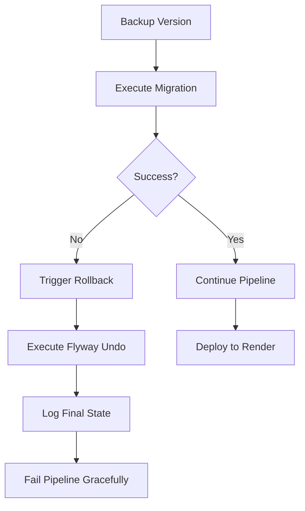

# 🔄 Rollback Automático de Migrations

## 📋 Visão Geral

O pipeline de CI/CD agora possui **rollback automático** de migrations! Se algo der errado após executar uma migration, ela será revertida automaticamente.

---

## 🎯 Como Funciona

### Pipeline com Rollback

```
1. ✅ Backup da versão atual (flywayInfo)
2. 🚀 Executar migrations (flywayMigrate)
3. ❌ SE falhar:
   └─ 🔄 Rollback automático (flywayUndo)
   └─ 📋 Log do estado final
   └─ ⚠️ Notificar erro
```

### Passos no GitHub Actions

#### DEV Pipeline:
```yaml
- Get Current Migration Version (Backup)  # Salva estado atual
- Run Database Migrations on DEV          # Executa migrations
- Rollback Migrations on Failure (DEV)    # Se falhar, reverte
```

#### PROD Pipeline:
```yaml
- Get Current Migration Version (Backup)  # Salva estado atual
- Run Database Migrations on PROD         # Executa migrations
- Rollback Migrations on Failure (PROD)   # Se falhar, reverte
```

---

## 📝 Como Criar Migrations com Undo

Para o rollback automático funcionar, você precisa criar **migrations de undo** para cada migration.

### Estrutura de Arquivos

```
src/main/resources/db/migration/
├── V1__Create_users_table.sql        # Migration normal
├── U1__Create_users_table.sql        # Migration de UNDO
├── V2__Add_email_to_users.sql        # Migration normal
└── U2__Add_email_to_users.sql        # Migration de UNDO
```

### Convenção de Nomenclatura

| Tipo | Prefixo | Exemplo |
|------|---------|---------|
| **Migration Normal** | `V` | `V1__Create_users_table.sql` |
| **Migration Undo** | `U` | `U1__Create_users_table.sql` |

⚠️ **IMPORTANTE**: O número da versão deve ser o mesmo!

---

## 💡 Exemplos de Migrations com Undo

### Exemplo 1: Criar Tabela

#### `V1__Create_users_table.sql` (Forward)
```sql
-- Migration: Criar tabela de usuários
CREATE TABLE users (
    id BIGSERIAL PRIMARY KEY,
    username VARCHAR(50) NOT NULL UNIQUE,
    email VARCHAR(100) NOT NULL UNIQUE,
    password_hash VARCHAR(255) NOT NULL,
    created_at TIMESTAMP DEFAULT CURRENT_TIMESTAMP,
    updated_at TIMESTAMP DEFAULT CURRENT_TIMESTAMP
);

CREATE INDEX idx_users_username ON users(username);
CREATE INDEX idx_users_email ON users(email);
```

#### `U1__Create_users_table.sql` (Undo)
```sql
-- Rollback: Remover tabela de usuários
DROP INDEX IF EXISTS idx_users_email;
DROP INDEX IF EXISTS idx_users_username;
DROP TABLE IF EXISTS users;
```

---

### Exemplo 2: Adicionar Coluna

#### `V2__Add_profile_to_users.sql` (Forward)
```sql
-- Migration: Adicionar campos de perfil
ALTER TABLE users 
ADD COLUMN first_name VARCHAR(50),
ADD COLUMN last_name VARCHAR(50),
ADD COLUMN bio TEXT,
ADD COLUMN avatar_url VARCHAR(255);
```

#### `U2__Add_profile_to_users.sql` (Undo)
```sql
-- Rollback: Remover campos de perfil
ALTER TABLE users 
DROP COLUMN IF EXISTS avatar_url,
DROP COLUMN IF EXISTS bio,
DROP COLUMN IF EXISTS last_name,
DROP COLUMN IF EXISTS first_name;
```

---

### Exemplo 3: Criar Relacionamento

#### `V3__Create_posts_table.sql` (Forward)
```sql
-- Migration: Criar tabela de posts
CREATE TABLE posts (
    id BIGSERIAL PRIMARY KEY,
    user_id BIGINT NOT NULL,
    title VARCHAR(200) NOT NULL,
    content TEXT NOT NULL,
    created_at TIMESTAMP DEFAULT CURRENT_TIMESTAMP,
    updated_at TIMESTAMP DEFAULT CURRENT_TIMESTAMP,
    CONSTRAINT fk_posts_user FOREIGN KEY (user_id) 
        REFERENCES users(id) ON DELETE CASCADE
);

CREATE INDEX idx_posts_user_id ON posts(user_id);
CREATE INDEX idx_posts_created_at ON posts(created_at);
```

#### `U3__Create_posts_table.sql` (Undo)
```sql
-- Rollback: Remover tabela de posts
DROP INDEX IF EXISTS idx_posts_created_at;
DROP INDEX IF EXISTS idx_posts_user_id;
DROP TABLE IF EXISTS posts;
```

---

### Exemplo 4: Inserir Dados

#### `V4__Insert_default_roles.sql` (Forward)
```sql
-- Migration: Inserir roles padrão
CREATE TABLE roles (
    id BIGSERIAL PRIMARY KEY,
    name VARCHAR(50) NOT NULL UNIQUE,
    description TEXT
);

INSERT INTO roles (name, description) VALUES
('ADMIN', 'Administrador do sistema'),
('USER', 'Usuário comum'),
('MODERATOR', 'Moderador de conteúdo');
```

#### `U4__Insert_default_roles.sql` (Undo)
```sql
-- Rollback: Remover roles padrão
DELETE FROM roles WHERE name IN ('ADMIN', 'USER', 'MODERATOR');
DROP TABLE IF EXISTS roles;
```

---

## 🔧 Configuração do Flyway

Para o rollback funcionar, você precisa configurar o Flyway no `build.gradle`:

### `build.gradle`
```gradle
plugins {
    id 'org.flywaydb.flyway' version '10.0.0'
}

flyway {
    url = System.getenv('SPRING_DATASOURCE_URL') ?: 'jdbc:postgresql://localhost:5432/studyhelper'
    user = System.getenv('SPRING_DATASOURCE_USERNAME') ?: 'postgres'
    password = System.getenv('SPRING_DATASOURCE_PASSWORD') ?: 'postgres'
    locations = ['classpath:db/migration']
    
    // Configuração para undo
    undoSqlMigrationPrefix = 'U'
    
    // Validação
    validateOnMigrate = true
    cleanDisabled = true
}
```

---

## 🚀 Comandos Úteis

### Executar Migrations
```bash
./gradlew flywayMigrate
```

### Ver Status das Migrations
```bash
./gradlew flywayInfo
```

### Fazer Rollback Manual
```bash
# Desfazer última migration
./gradlew flywayUndo

# Desfazer até uma versão específica
./gradlew flywayUndo -Dflyway.target=2
```

### Validar Migrations
```bash
./gradlew flywayValidate
```

### Limpar Banco (⚠️ CUIDADO!)
```bash
# APENAS EM DEV! Remove tudo do banco
./gradlew flywayClean
```

---

## 🎯 Boas Práticas

### ✅ DO (Faça)

1. **Sempre crie migrations de undo**
   ```
   V1__*.sql → Sempre acompanhado de U1__*.sql
   ```

2. **Teste o undo localmente antes de comitar**
   ```bash
   ./gradlew flywayMigrate  # Aplicar
   ./gradlew flywayUndo     # Testar undo
   ./gradlew flywayMigrate  # Aplicar novamente
   ```

3. **Use transações quando possível**
   ```sql
   BEGIN;
   -- suas alterações
   COMMIT;
   ```

4. **Documente migrations complexas**
   ```sql
   -- Migration: V5__Complex_schema_change.sql
   -- Objetivo: Refatorar estrutura de posts
   -- Autor: Seu Nome
   -- Data: 2025-11-12
   ```

5. **Use IF EXISTS/IF NOT EXISTS**
   ```sql
   DROP TABLE IF EXISTS users;
   CREATE TABLE IF NOT EXISTS posts (...);
   ```

---

### ❌ DON'T (Não Faça)

1. ❌ **Não modifique migrations já aplicadas**
   - Crie uma nova migration em vez disso

2. ❌ **Não use `flywayClean` em produção**
   - Isso apaga TUDO do banco!

3. ❌ **Não faça alterações irreversíveis sem undo**
   ```sql
   -- ❌ Ruim (sem undo)
   DROP TABLE users;
   
   -- ✅ Bom (com undo preparado)
   -- V: DROP TABLE users;
   -- U: CREATE TABLE users (...);
   ```

4. ❌ **Não commite migrations não testadas**
   - Sempre teste localmente primeiro

5. ❌ **Não misture DDL e DML sem cuidado**
   ```sql
   -- ❌ Ruim
   ALTER TABLE users ADD COLUMN role_id BIGINT;
   INSERT INTO users (role_id) VALUES (1);  -- Pode falhar!
   
   -- ✅ Bom (separar em migrations diferentes)
   ```

---

## 🧪 Testar Rollback Localmente

### Cenário de Teste

```bash
# 1. Ver estado atual
./gradlew flywayInfo

# 2. Aplicar nova migration
./gradlew flywayMigrate

# 3. Verificar se funcionou
psql -U postgres -d studyhelper -c "\dt"

# 4. Testar rollback
./gradlew flywayUndo

# 5. Verificar se reverteu
psql -U postgres -d studyhelper -c "\dt"

# 6. Reaplicar
./gradlew flywayMigrate
```

---

## 🔍 Verificar Rollback no CI/CD

### Logs do GitHub Actions

Se uma migration falhar, você verá:

```
⚠️ Migration falhou! Iniciando rollback...
🔄 Executando Flyway undo para reverter última migration...
📋 Status das migrations após rollback:
+-------------+---------+-------------+------+
| Version     | State   | Description | Type |
+-------------+---------+-------------+------+
| 1           | Success | Create users| SQL  |
| 2           | Success | Add profile | SQL  |
| 3           | Undone  | Create posts| SQL  |  ← Revertida!
+-------------+---------+-------------+------+
❌ Pipeline falhou mas migrations foram revertidas!
```

---

## 📊 Fluxo Completo de Rollback



---

## 🆘 Troubleshooting

### Erro: "Undo migration not found"

**Problema**: Você não criou a migration de undo.

**Solução**:
```bash
# Criar migration de undo
touch src/main/resources/db/migration/U<version>__<description>.sql
```

---

### Erro: "Cannot undo migration with pending changes"

**Problema**: Há migrations não aplicadas.

**Solução**:
```bash
# Aplicar todas as migrations primeiro
./gradlew flywayMigrate

# Depois fazer undo
./gradlew flywayUndo
```

---

### Rollback não funciona no CI/CD

**Problema**: `flywayUndo` requer Flyway Teams (pago).

**Solução Alternativa**: Criar migration de compensação manualmente:
```sql
-- V5__Rollback_V4.sql
-- Este é um rollback manual da V4
DROP TABLE IF EXISTS new_table;
```

---

## 📚 Recursos

- [Flyway Undo Migrations](https://flywaydb.org/documentation/concepts/migrations#undo-migrations)
- [Flyway Commands](https://flywaydb.org/documentation/usage/commandline/)
- [PostgreSQL Transactions](https://www.postgresql.org/docs/current/tutorial-transactions.html)

---

## ✅ Checklist de Migration

Antes de criar uma migration:

- [ ] Migration forward criada (`V*.sql`)
- [ ] Migration undo criada (`U*.sql`)
- [ ] Testada localmente (migrate + undo + migrate)
- [ ] Documentada no arquivo SQL
- [ ] Usa `IF EXISTS`/`IF NOT EXISTS`
- [ ] Revisada por outro desenvolvedor
- [ ] Commitada com mensagem descritiva

---

**🎉 Agora você tem rollback automático de migrations! Seu banco de dados está protegido.** 🛡️
