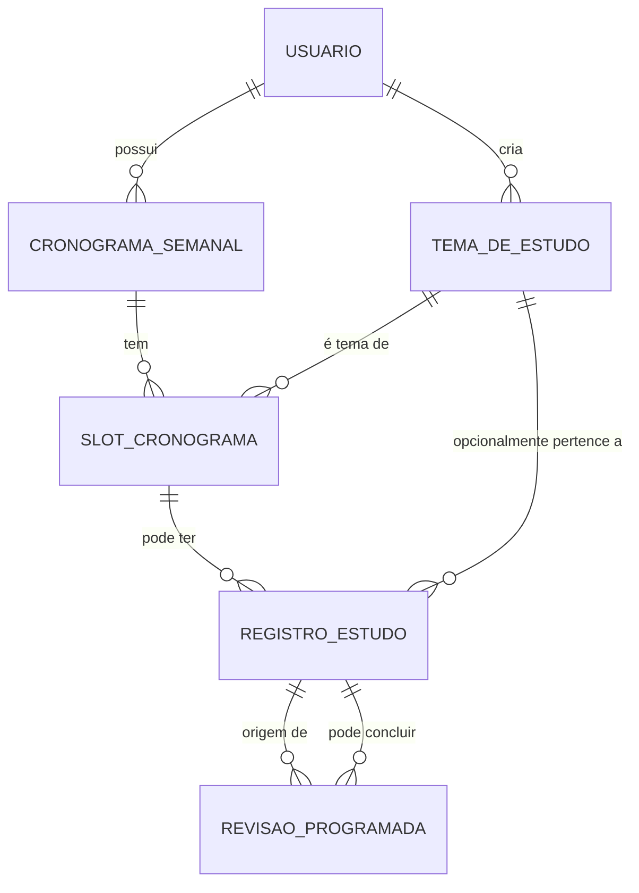

# Relacionamentos e Métricas — Prisma / Modelos do Study Helper ✅

Este documento resume os relacionamentos entre os modelos do Prisma, mostra um diagrama Mermaid, exemplos de queries para saber se um _slot_ teve registro numa data, e recomendações de modelagem e índices para métricas.

---

## Diagrama (Mermaid)



---

## Resumo das responsabilidades e "quem fica dentro de quem" 🔍

- **Usuario**: dono das entidades (tem `creatorId`/`usuario_id` nas tabelas relacionadas).
- **CronogramaSemanal**: pertence a um `Usuario` e contém muitos `SlotCronograma`.
- **SlotCronograma**: pertence a um `CronogramaSemanal`, referencia um `TemaDeEstudo` e tem muitos `RegistroEstudo` e `RevisaoProgramada`.
- **RegistroEstudo**: pode vincular-se a um `SlotCronograma` (campo `slotId`) ou ser estudo livre; pode gerar ou concluir `RevisaoProgramada`.
- **RevisaoProgramada**: referencia `registroOrigem` e opcionalmente `registroConclusao`.

---

## Como consultar: “para um slot numa data, houve registro?” ✅

Observação: `dataEstudo` é DateTime; compare usando um intervalo (startOfDay, nextDay) para cobrir toda a data.

Exemplo em Prisma (JS/TS):

```ts
const startOfDay = new Date(Date.UTC(year, monthIndex, day, 0, 0, 0));
const endOfDay = new Date(Date.UTC(year, monthIndex, day + 1, 0, 0, 0));

const registro = await prisma.registroEstudo.findFirst({
  where: {
    slotId: slotId,
    creatorId: userId,
    dataEstudo: { gte: startOfDay, lt: endOfDay },
  },
});

const houveRegistro = Boolean(registro);
```

Outra forma: partir do `SlotCronograma` e incluir `registros` filtrando por data.

```ts
const slot = await prisma.slotCronograma.findUnique({
  where: { id: slotId },
  include: {
    registros: {
      where: {
        dataEstudo: { gte: startOfDay, lt: endOfDay },
        creatorId: userId,
      },
    },
  },
});

const houveRegistro = slot?.registros.length > 0;
```

SQL equivalente:

```sql
SELECT count(*)
FROM registros_estudo
WHERE slot_id = $1
  AND data_estudo >= '2026-01-07'::date
  AND data_estudo <  ('2026-01-07'::date + INTERVAL '1 day');
```

---

## Métricas e agrupamentos por dia 📊

Query (Postgres) para contar registros por slot por dia:

```sql
SELECT slot_id, date_trunc('day', data_estudo) AS dia, count(*) AS registros
FROM registros_estudo
WHERE creator_id = $USER_ID
GROUP BY slot_id, date_trunc('day', data_estudo);
```

No Prisma, para grouping por dia você provavelmente usará `queryRaw` ou manter uma coluna date-only (ver seção abaixo) para facilitar `groupBy`.

---

## Regras de negócio (resumo aplicado) 📋

- Todas as entidades são privadas ao usuário criador (visibilidade por `creatorId`).
- Usuário: tem temas, um cronograma semanal, registros e revisões.
- CronogramaSemanal: um por usuário; contém `SlotCronograma` com ordem e diaSemana.
- RegistroEstudo: tipos = `EstudoDeTema`, `RevisaoProgramada`, `EstudoAberto`.
  - Somente `EstudoDeTema` gera revisões e é o tipo que deve (por regra de negócio) vincular-se ao `slotId`.
  - `RevisaoProgramada` atualiza o status da revisão relacionada; não gera novas revisões.
  - `dataEstudo` guarda data/hora do estudo (UTC recomendado).
- TemaDeEstudo: guarda `tema`, `descricao`, `cor` (hex), `creatorId`.
- RevisaoProgramada: guarda `dataRevisao` e status; relaciona-se ao `registroOrigem` que traz o `tema` e, indiretamente, o `slot`.

> Observação: várias regras (ex.: impedir que um `RevisaoProgramada` seja vinculado ao `slotId`) devem ser aplicadas na camada de aplicação (validations / middlewares / services). Algumas restrições avançadas podem ser implementadas via check constraints/migrations manuais caso necessário.

---

## Fluxos principais implementados ⚙️

- **Cronograma semanal**
  - `GET /cronograma` retorna slots com status (`concluido`, `pendente`, `atrasado`) calculado conforme a semana de referência e `primeiroDiaSemana` do usuário.
  - `PUT /cronograma` substitui a lista completa de slots, validando se cada slot pertence ao usuário e referenciando temas válidos.
- **Temas de estudo (`/themes`)**
  - CRUD simples com cor hexadecimal opcional e retorno de contadores de slots/registros relacionados.
- **Registros de estudo (`/registros`)**
  - `POST` aceita os três tipos (`EstudoDeTema`, `Revisao`, `EstudoAberto`) e aplica regras:
    - EstudoDeTema exige `temaId` + `slotId`, gera revisões automaticamente com base em `planejamentoRevisoes` do usuário.
    - Revisao requer `revisaoProgramadaId` e marca a revisão como `Concluida`.
    - EstudoAberto não aceita revisão ou slot.
  - `GET` lista registros do usuário com filtro opcional por data (intervalo [dia, dia+1)).
- **Revisões programadas (`/revisoes`)**
  - Atualiza automaticamente os status (`Pendente`, `Adiada`, `Atrasada`) conforme a data-alvo.
  - `PATCH /:id/concluir` reutiliza o fluxo de registros para criar o estudo de revisão.
  - `PATCH /:id/adiar` normaliza e grava a nova data como `Adiada`.
- **Relatórios (`/relatorios/resumo`)**
  - Entrega métricas básicas: total de estudos, tempo acumulado, revisões concluídas/pendentes/atrasadas, revisões do dia e top temas.

---

## Recomendações de modelagem e índices 🔧

1. Índices úteis (consultas frequentes: slot + data):

- Adicionamos um índice composto para acelerar consultas por slot e data:

```prisma
model RegistroEstudo {
  // ...campos existentes
  @@index([slotId, dataEstudo])
  @@index([creatorId, dataEstudo])
}
```

- Também adicionamos índice para `TemaDeEstudo.creatorId` para consultas e listas do usuário:

```prisma
model TemaDeEstudo {
  // ...campos existentes
  @@index([creatorId])
}
```

2. Coluna `date-only` (opcional, facilita agregações):

- Opção A (simples): adicionar campo `dataEstudoDia DateTime` e preencher na aplicação com `date` (00:00 UTC) ao criar o registro. Isso torna índices e agrupamentos simples.

- Opção B (DB-generated): criar coluna `date` no Postgres (tipo `date`) gerada a partir de `data_estudo` (exemplo SQL):

```sql
ALTER TABLE registros_estudo
ADD COLUMN data_estudo_date date GENERATED ALWAYS AS ((data_estudo::date)) STORED;
-- e adicione índice: CREATE INDEX ON registros_estudo (slot_id, data_estudo_date);
```

Observação: nem sempre o Prisma lida com colunas geradas diretamente via schema — às vezes é preciso uma migration SQL manual.

3. Para dashboards com grandes volumes: considere materialized view ou job que popula uma tabela de agregados diários (por slot/usuario) para leitura rápida.

---

## Endpoints de backend disponíveis 📡

- `POST /themes`, `GET /themes`, `GET /themes/:id`, `PATCH /themes/:id`, `DELETE /themes/:id`
- `GET /cronograma`, `PUT /cronograma`
- `GET /registros`, `POST /registros`
- `GET /revisoes`, `PATCH /revisoes/:id/concluir`, `PATCH /revisoes/:id/adiar`
- `GET /relatorios/resumo`

Todas as rotas exigem autenticação via `JwtAuthGuard` e respeitam os limites por `creatorId`.

---

## Boas práticas / notas sobre timezone ⚠️

- Armazene `dataEstudo` em UTC e converta ao calcular `startOfDay`/`endOfDay` usando o timezone do usuário.
- Considere normalizar a parte `date` ao criar um registro (campo extra) para evitar cálculos repetidos em queries.

---

## Próximos passos sugeridos

- Se quiser, eu posso gerar o snippet Prisma para adicionar o índice (e preparar a migration), ou adicionar a coluna `data_estudo_date` (via migration SQL) e exemplificar as queries com o novo campo.

---

Se quiser que eu gere a migration ou adicione o índice direto no `schema.prisma`, diga qual opção prefere (índice composto simples / coluna date / materialized view) e eu implemento.
